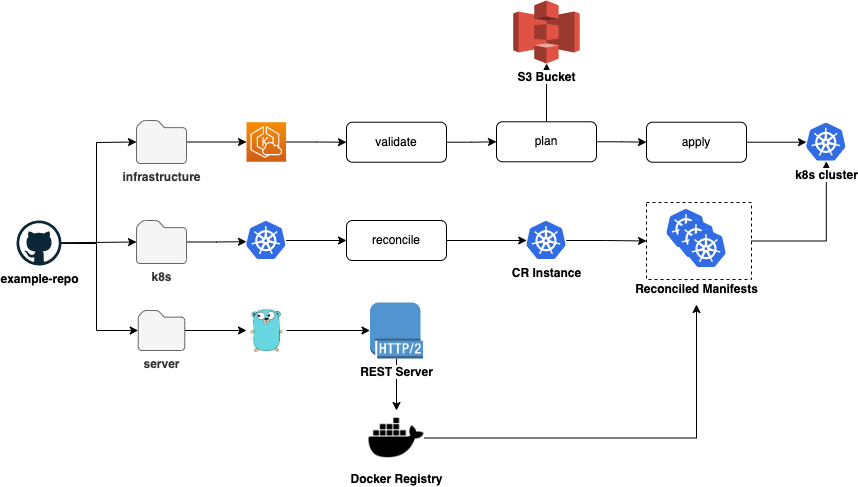

# Portfolio Demo

- [Portfolio Demo](#portfolio-demo)
  - [Overview](#overview)
    - [Infrastructure](#infrastructure)
    - [K8s](#k8s)
    - [Server](#server)
  - [Architecture Diagrams](#architecture-diagrams)
  - [Running the PoC](#running-the-poc)
    - [Prerequisites:](#prerequisites)
      - [Tools](#tools)
      - [Env Vars](#env-vars)
    - [What is Installed](#what-is-installed)
  - [Tearing Down the PoC](#tearing-down-the-poc)
  - [Testing](#testing)
    - [Infrastructure](#infrastructure-1)
    - [K8s](#k8s-1)
    - [Server](#server-1)

## Overview

This repository is meant to be a demonstration / PoC repository for a sample DevOps project.  The parts of the repository are as follows:

1. Infrastructure
2. K8s
3. Server

### Infrastructure

Infrastructure contains the IaC code (terraform) needed to provision the k8s environment in the public cloud of your choosing (currently only AWS is supported). 

### K8s

K8s contains the manfiests and codes needed to deploy the server to the k8s environment. 

### Server

Server contains the code needed to standup an example REST server container that can be deployed to a running kubernetes environment. 

## Architecture Diagrams



## Running the PoC 

Please read [the prerequisites](#prerequisites) before installing the application. 

To run the PoC sample the [deploy_config.yaml](./deploy_config.yaml) __must__ be configured to provide script configuration options.  Once the configuration is completed, the [deploy_poc.sh](./deploy_poc.sh) script can be ran to fully stand the PoC up on a public cloud environment. 

Before running the PoC please ensure the following credential steps are taken:

1. `docker login` performed to ensure the images can be pushed to their repositories
2. `aws configure` performed to ensure access to the configured S3 bucket to store the TF state (optional)

### Prerequisites:

#### Tools

| Requisite | Version (tested) |
| :-------- | :--------------- |
| `docker` | `20.10.14` |
| `go` | `1.20.4` |
| `kubectl` | `1.27` |
| `terraform` | `1.4.6` | 
| `yq` | `4.34.1` |
| `aws` | `2.11.23` |

#### Env Vars

| Requisite | Value |
| :-------- | :---- |
| `AWS_ACCESS_KEY_ID` | The API key ID required for the terraform module to access the AWS environment |
| `AWS_SECRET_ACCESS_KEY` | The API key secret value required for the terraform module to access the AWS environment |

### What is Installed

When running the PoC the following items will be installed:

1. A k8s cluster installed to the public cloud
   1. Node for running the code
      1. Node group for tying the nodes to the cluster
   2. VPC created to allo networking for the cluster
   3. 4 subnets
      1. 2 private
      2. 2 public
   4. Security IAM groups and bindings allowing resource connectivity 
   5. TLS certificates for the cluster connection
   6. Cloudwatch log groups
2. An operator controller image that is built and pushed to a docker repository with anonymous pull 
   1. Can be skipped if `deploy.no_build` is set to a truthy value in the config file
3. An operator controller image is deployed to the running environment
   1. k8s manifests:
      1. `ServiceAccount`
      2. `Deployment`
         1. `ReplicaSet`
            1. `Pod`
      3. `ClusterRole`
      4. `ClusterRoleBinding`
      5. `CRD`
4. A REST server container image that is built and pushed to a docker repository with anonymous pull 
   1. Can be skipped if `deploy.no_build` is set to a truthy value in the config file
5. A REST server image is deployed to the running environment
   1. k8s manifests:
      1. `Deployment`
      2. `ServiceAccount`
      3. `Service`
      4. `Application`
         1. The resources above are generated by the controller based on the definition defined in the application CR

## Tearing Down the PoC

To tear down the PoC the following can be ran:

```
% cd infrastructure/aws

% terraform destroy -auto-approval
```

The above terraform command will completely remove all created public cloud resources, which will destroy the running applications as well. 

## Testing

Test practices and procedures are documented in each sections's own `README.md`, however and overview of this will be given here.

### Infrastructure

[Full Details](./infrastructure/aws/README.md)

The testing for this is handled via linter enforcement of terraform best practices, and can be run anytime with the [package lint script](./infrastructure/aws/lint).

### K8s

[Full Details](./k8s/README.md)

The testing for this is handled via unit tests for the controller package to codify the deployment pipeline, and the package provides an e2e test suite as well for ensuring reconciliation properly handles. 

To run the unit tests for the package perform the following:

```
% cd k8s

% make test
```

To run the e2e test suite for the package perform the following:

```
% cd k8s/test_e2e.sh

% ./test_e2e.sh
```

### Server

[Full Details](./server/README.md)

The testing for this is handled through golang unit testing and an e2e test provided for the router handling of the REST server.  

To run the unit and e2e tests for the package perform the following:

```
% cd server

% make test
```
