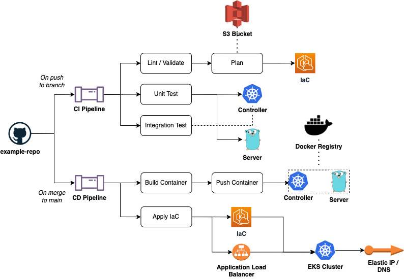

# Portfolio Demo

- [Portfolio Demo](#portfolio-demo)
  - [Overview](#overview)
    - [Infrastructure](#infrastructure)
    - [K8s](#k8s)
    - [Server](#server)
  - [Architecture Diagrams](#architecture-diagrams)
  - [Running the PoC](#running-the-poc)
    - [Prerequisites:](#prerequisites)
      - [Tools](#tools)
      - [Env Vars](#env-vars)
    - [What is Installed](#what-is-installed)
      - [(1) Check Prerequisites](#1-check-prerequisites)
      - [(2) Check Environment Settings](#2-check-environment-settings)
      - [(3) Server Creation](#3-server-creation)
      - [(4) Infrastructure](#4-infrastructure)
      - [(5) Configure Cluster Credentials](#5-configure-cluster-credentials)
      - [(6) Setup Load Balancer](#6-setup-load-balancer)
      - [(7) Configure Namespace Context](#7-configure-namespace-context)
      - [(8) Controller (k8s)](#8-controller-k8s)
      - [(9) Display REST Endpoint](#9-display-rest-endpoint)
      - [(10) Verify Environment](#10-verify-environment)
    - [Verifying the Install](#verifying-the-install)
  - [Tearing Down the PoC](#tearing-down-the-poc)
  - [Testing](#testing)
    - [Infrastructure](#infrastructure-1)
    - [K8s](#k8s-1)
    - [Server](#server-1)

## Overview

This repository is meant to be a demonstration / PoC repository for a sample DevOps project.  The parts of the repository are as follows:

1. Infrastructure
2. K8s
3. Server

### Infrastructure

[Infrastructure](./infrastructure/) contains the IaC code (terraform) needed to provision the k8s environment in the public cloud of your choosing (currently only AWS is supported). 

### K8s

[K8s](./k8s/) contains the manfiests and codes needed to deploy the server to the k8s environment. 

### Server

[Server](./server/) contains the code needed to standup an example REST server container that can be deployed to a running kubernetes environment. 

## Architecture Diagrams



## Running the PoC 

Please read [the prerequisites](#prerequisites) before installing the application. 


To run the PoC sample the [deploy_config.yaml](./deploy_config.yaml) __must__ be configured to provide script configuration options.  Once the configuration is completed, the [deploy_poc.sh](./deploy_poc.sh) script can be ran to fully stand the PoC up on a public cloud environment. 

Before running the PoC please ensure the following credential steps are taken:

1. `docker login` performed to ensure the images can be pushed to their repositories
   1. _Only required is `.deploy.build` is set to `true`_
2. `aws configure` performed to ensure access to the configured S3 bucket to store the TF state (optional)
   1. _Only required if the backend configurationg for the terraform file is set to S3_

### Prerequisites:

#### Tools

| Requisite | Version (tested) | Reason |
| :-------- | :--------------- | :----- |
| `docker` | `20.10.14` | To build and push container images on change, Docker is needed.  If running PoC with `.deploy.no_build` set, this can be ignored. |
| `go` | `1.20.4` | Required to build binaries from source and perform testing, if running PoC with `.deploy.no_build` set, this can be ignored. |
| `kubectl` | `1.27` | Required to interact with the cluster and deploy resources. |
| `terraform` | `1.4.6` | Required to provision the AWS environment in the public cloud. |
| `yq` | `4.34.1` | Required to read configuration information for the PoC script. |
| `aws` | `2.11.23` | Required to get and set cluster credential information to deploy the application. |
| `eksctl` | `0.143.0` | Required to enable AWS load balancing (is optional is the `.deploy.load_balancer.enabled` iss set to `true`). |
| `minikube` | `v1.30.1` | This is only required for local development testing of the k8s controller. |

#### Env Vars

| Requisite | Value |
| :-------- | :---- |
| `AWS_ACCESS_KEY_ID` | The API key ID required for the terraform module to access the AWS environment |
| `AWS_SECRET_ACCESS_KEY` | The API key secret value required for the terraform module to access the AWS environment |

### What is Installed

When running the PoC there are logical steps that are taken in the installation script.  This section will describe each logical step, what actions they perform, how to enable/disable them, and what resources are deployed as part of the step being ran. 

#### (1) Check Prerequisites 

##### Description

This step is responsible for checking to verify all prerequisites exist on the host machine before running the script to deploy the PoC.  If a prerequisite is missing this is a critical error and prevents the script from continuing.

##### Actions Performed 

1. For each prerequisite defined, determine if available to the command or not by performing a `which` statement.

##### Resources Deployed

_None_

#### (2) Check Environment Settings

##### Description

There are a few environment variables needed to connect to the AWS environment to provision the infrastructure.  This step will check if those values are set or not and fail when not present. 

##### Actions Performed 

1. For each prerequisite env var required, determine if available to the command or not by performing a `env` statement.

##### Resources Deployed

_None_

#### (3) Server Creation

##### Description

This step will build and push the REST server to the container repository defined in the config file.  If the `.deploy.no_build` setting is set to `true`, then this step is skipped entirely. The image repository name is dynamically produced via the following configuration settings: 

```tpl
${{.deploy.registry}}/${{.deploy.server.repository}}:${{.deploy.server.tag}}
```

##### Actions Performed 

The following actions are performed in this step, when the build is configured to run. 

1. Build the server image and tag it via the above scheme
2. Push the server image to the destination repository

> NOTE: There is currently not a step to configure an image pull secret, so the destination repository must have anonymous image pulling enabled, or the resulting deploy will be in a constant back off due to `ImagePullBackOff` in the container create step of the Pods. 

##### Resources Deployed

1. A container image to the defined destination repository

#### (4) Infrastructure

##### Description

This step is responsible for deploying the public cloud infrastructure.  Currently, only AWS is supported as a public cloud vendor, but the [infrastructure](./infrastructure/) folder is designed to hold more than one public cloud.  This allows extensibility into other vendors for future enhancements. 

> NOTE: This step currently is configured to use an S3 bucket as the backend that the owner of this git repository owns.  If you do not have IAM delegated access to this bucket and perform an `aws configure`, then remove the backend config section from the [terraform.tf](./infrastructure/aws/terraform.tf) file to proceed (or update to point to an S3 bucket owned by the runner, and perform the required login steps to allow terraform to access the bucket). 

##### Actions Performed 

1. Terraform plan on the declared resources to determine what changes will be made to the environment 
2. Displays the plan to the user, so that it can be reviewed and confirmed before executing the plan
3. On confirmation, perform a terraform apply for the generated plan

##### Resources Deployed

1. A Kubernetes EKS cluster in the defined region
   1. A node group for the EC2 virtual host nodes 
      1. A singlular node in the node group that servers as a master and a worker for the PoC setup
2. A VPC that is tied to the EKS cluster
   1. 4 subnets under the VPC
      1. 2 Public 
      2. 2 Private
3. Various IAM bindings and security groups to allow network traffic on the VPC/Cluster and allow different components to communicate
4. A NAT gateway for the VPC to allow egress from the network
   1. This includes an internet gateway as well, including multiple network interfaces

#### (5) Configure Cluster Credentials

##### Description

This step uses the `aws` command line tool to configure the `$HOME/.kube/config` file for cluster access to the environment deployed in the previous step. 

##### Actions Performed 

1. Use public cloud vendor CLI to generate the kubernetes cluster credential file

##### Resources Deployed

_None_

#### (6) Setup Load Balancer

##### Description

This step is optional and is only ran when `.deploy.load_balancer.deploy` is set to a `true` value.  This step will install the AWS ALB load balancing controller to the provisioned cluster, and setup the appropriate OIDC and IAM bindings to allow the controller to create load balancer resources in the AWS env.  The resulting ingress objects will dynamically generate a host name to allow the REST server to be routable on the public internet. 

##### Actions Performed 

1. Download the IAM policy for the load balancer 
2. Install the IAM policy for the load balancer
3. Determine the IAM policy ARN for use later
4. Create the kubernetes service account that will run the ALM load balancer controller and bind that service account to the IAM policy using the ARN
   1. This allows the OIDC provider to grant permissions to the service account, that allows the controller on the cluster to interact with the AWS account and perform actions (such as creating load balancer resources)
5. Download the Jetstack Certificate Manager and install to the cluster
   1. This is required to enable TLS on the resulting routes
6. Download the AWS ALB ingress controller and install to the cluster 
   1. There is a step to fix the CRDs as well, and that downloads the CRD definition from the latest Helm chart
7. The load balancer service account's metadata is updated to bind the role on the cluster so the OIDC provider can perform its actions 

##### Resources Deployed

1. An IAM policy that allows the ALB load balancer controller to perform the required actions on the AWS account
2. A service account to the k8s cluster that is bound to the IAM policy using a role 
3. The ALB load balancer stack
   1. Please view full list of resources and their manifest definitions here [ALB Controller](https://github.com/kubernetes-sigs/aws-load-balancer-controller/releases/download/v2.4.1/v2_4_1_full.yaml)
4. The Jetstack Cert Manager stack
   1. Please view full list of resources and their manifest definitions here [Jetstack](https://github.com/jetstack/cert-manager/releases/download/v1.6.0/cert-manager.yaml)
  
#### (7) Configure Namespace Context

##### Description

This step sets the kubectl config context to use a defined namespace in the deploy file for the remainder of the install commands. 

##### Actions Performed 

1. Sets the kube config context for the current in use context to use the namespace defined in the `.deploy.namespace` field. 

##### Resources Deployed

1. The namespace defined in the `.deploy.namespace` configuration field if one does not already exist

#### (8) Controller (k8s)

##### Description

This step will create the k8s Operator controller to watch and manage the CRD instances we defined for the REST server.  Once the manager is deployed and running, this will create an instance of the CRD (a CR) as well to perform the actual deployment of the server. 

##### Actions Performed 

1. If the `deploy.no_build` setting is set to a `false` then the controller will be built and pushed to the repository defined in the tagging scheme
   1. `${{.deploy.registry}}/${{.deploy.controller.repository}}:${{.deploy.controller.tag}}`
2. Run the make target to install the CRDs to the cluster
3. Render the kustomize resources for the controller and deploy them to the k8s cluster
4. Apply the CR for eventual reconciliation by the controller

##### Resources Deployed

1. If the `deploy.no_build` setting is set to a `false` then a conroller image is built and pushed to the repository
2. Controller manifests:
   1. ClusterRole
   2. ClusterRoleBinding
   3. Namespace
      1. `acme-portfolio-example-manager`
   4. CRD
      1. `applications.acme.io`
   5. Deployment
      1. `controller-manager`
   6. ServiceAccount
      1. `controller-manager`
3. The application CR and the downstream resources the controller reconciles
   1. `application.acme.io` (`application-sample`)
      1. Deployment
      2. ServiceAccount
      3. Service
      4. Ingress (only valid when the ALB load balancer is deployed)

> NOTE: There is currently not a step to configure an image pull secret, so the destination repository must have anonymous image pulling enabled, or the resulting deploy will be in a constant back off due to `ImagePullBackOff` in the container create step of the Pods. 

#### (9) Display REST Endpoint

##### Description

This step attempts to get the host name from the deployed ingress and displays to the user, or `null` if no ingress host name is availabled, in which case the user should default to port-forwarding the service `service/application-sample` to access the REST interface. 

##### Actions Performed 

1. A kubectl get on the ingress definition to gather the host name from the ingress status

##### Resources Deployed

_None_

#### (10) Verify Environment 

##### Description

This step will run the [verify_e2e.sh](./verify_e2e.sh) script to verify the environment is set up correctly and provides the application REST endpoint. 

> NOTE: The k8s controller includes an e2e test script as well [here](./k8s/e2e/test_e2e.sh) that can be used in development to deeply verify the e2e functionality of the controller itself. 

##### Actions Performed 

1. Runs the [verify_e2e.sh](./k8s/e2e/test_e2e.sh) script to verify the REST server is available and all expected manifests are loaded

##### Resources Deployed

_None_

### Verifying the Install

The provided [verify_e2e.sh](./verify_e2e.sh) script can be used to verify the deployed environment. The load balancer install option is optional, and in the absence of the load balancer, the verify script will port forward the Pod's running port and verify from there.

## Tearing Down the PoC

To tear down the PoC the following can be run:

```sh
# The application must be deleted to cascade the deletion of cluster resources
# the load balancer in the AWS env must be deleted or it can cause 
# the subnet finalizers to not resolve properly resulting in orphaned resources. 
#
# This kubectl command will delete the application from the cluster.
% kubectl delete Application application-sample

# If the load balancer was deployed then the ingress must
# be cleaned up on the cluster, otherwise the VPCs will 
# block deletion until the load balancer is manually deleted from
# the AWS env
# % kubectl delete ing application-sample

# The following commands will remove the infrastructure
# provisioned in the PoC
% cd infrastructure/aws

% terraform destroy -auto-approve

# To cleanup the IAM permissions from the load balancer
# the following can be run
% aws iam delete-policy --policy-arn=$(aws iam list-policies --no-cli-pager --output yaml | yq -Mr '.Policies[] | select(.PolicyName == "AWSLoadBalancerControllerIAMPolicy") | .Arn')
```

The above terraform command will completely remove all created public cloud resources, which will destroy the running applications as well. 

## Testing

Test practices and procedures are documented in each sections's own `README.md`, however and overview of this will be given here.

### Infrastructure

[Full Details](./infrastructure/aws/README.md)

The testing for this is handled via linter enforcement of terraform best practices, and can be run anytime with the [package lint script](./infrastructure/aws/lint).

### K8s

[Full Details](./k8s/README.md)

The testing for this is handled via unit tests for the controller package to codify the deployment pipeline, and the package provides an e2e test suite as well for ensuring reconciliation properly handles. 

To run the unit tests for the package perform the following:

```sh
% cd k8s

% make test
```

To run the e2e test suite for the package perform the following:

> NOTE: `minikube` is a prerequisite for this test, as we stand up an ephemeral, local k8s cluster to perform tests on, as to not potentially conflict with a production environment. 

```sh
% cd k8s/test_e2e.sh

% ./test_e2e.sh
```

### Server

[Full Details](./server/README.md)

The testing for this is handled through golang unit testing and an e2e test provided for the router handling of the REST server.  

To run the unit and e2e tests for the package perform the following:

```
% cd server

% make test
```
